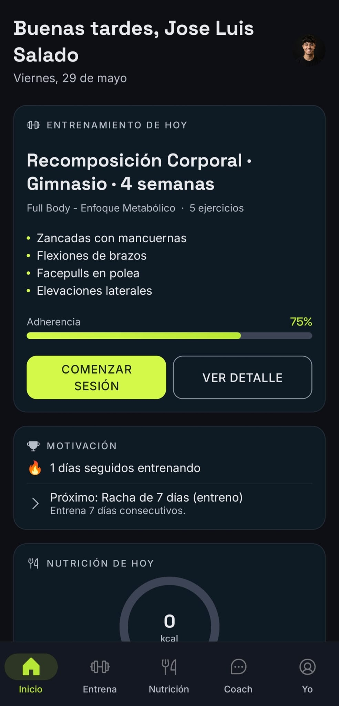
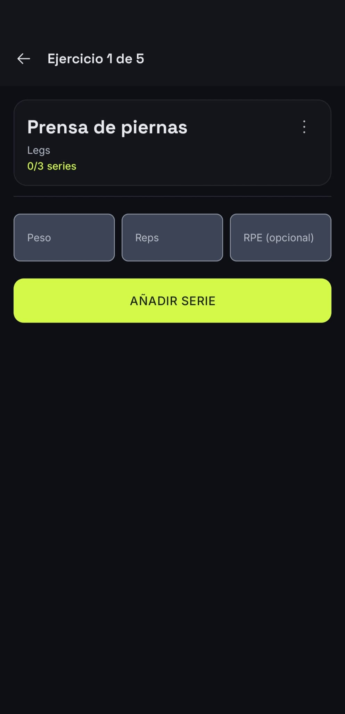
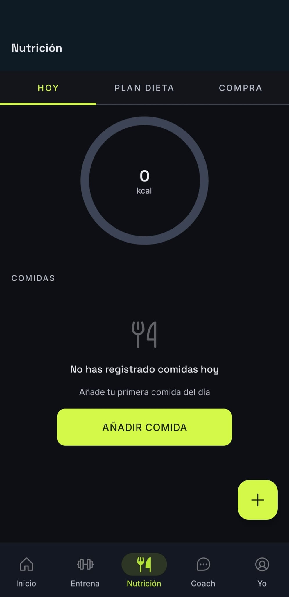
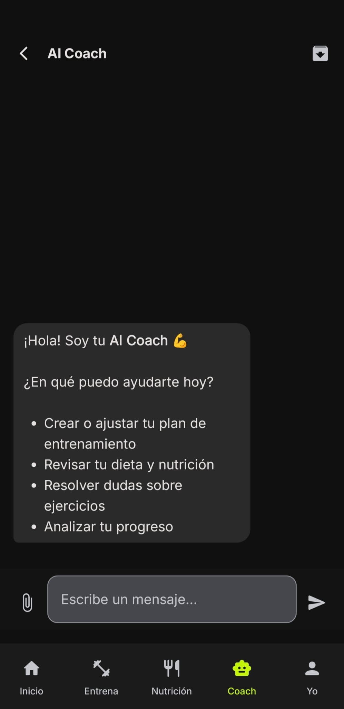
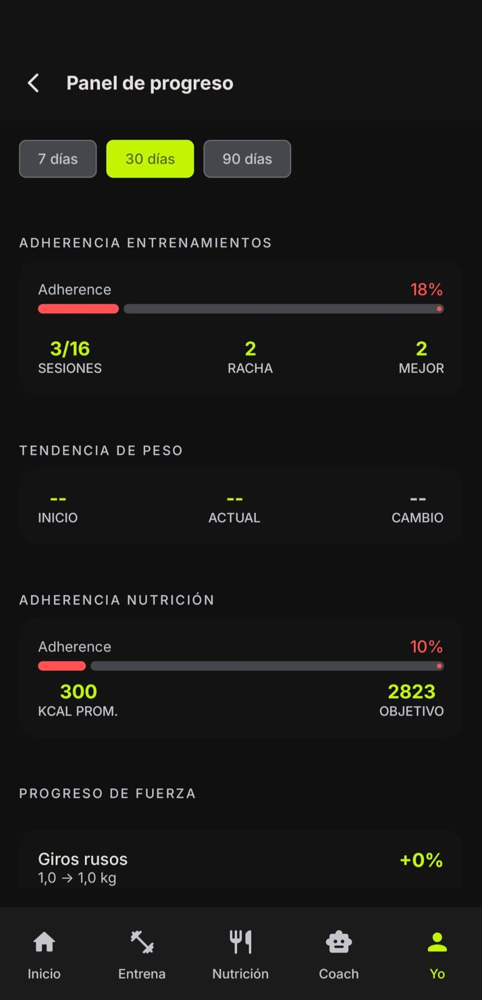
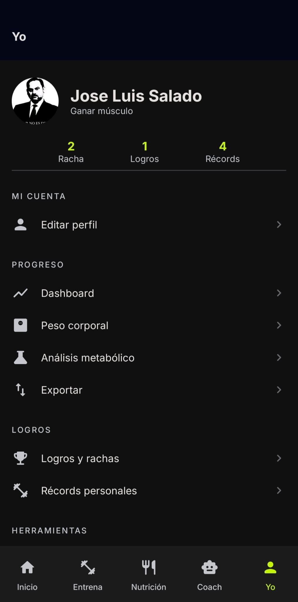
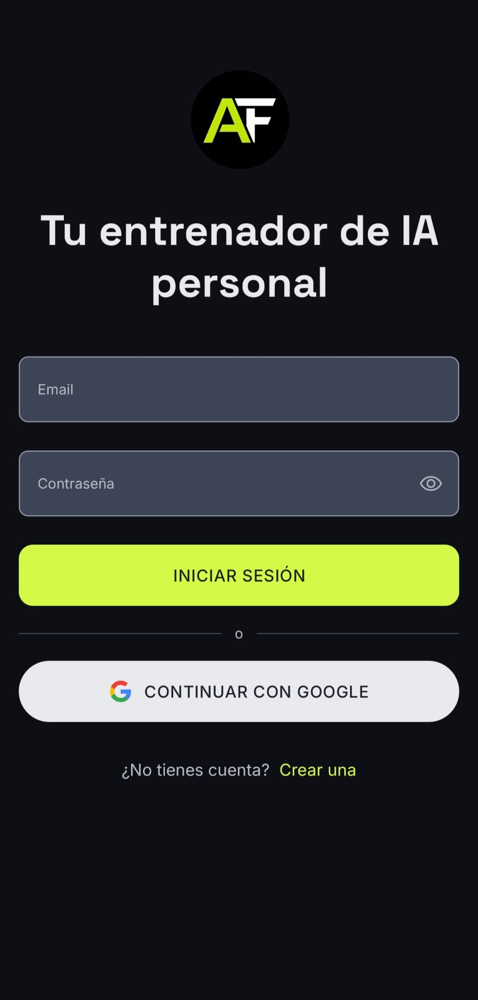
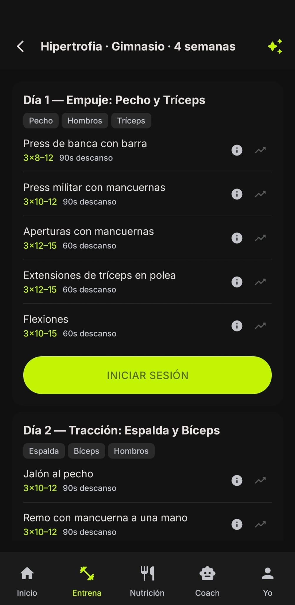
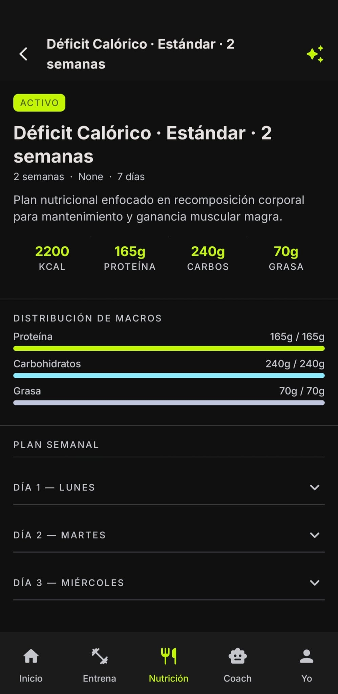

# AIFit

**Español** · [English](README.md)


> **Repositorio complementario:** este proyecto es el **cliente Android** de AIFit. La API REST, la lógica de negocio y los servicios de IA viven en el backend.
>
> ### [AIFit Backend (AIFit-API)](https://github.com/JL-SH/AIFit-API)
>
> Sin el backend en ejecución, la app no puede autenticar usuarios, generar planes, analizar comidas ni persistir datos.

---

## Descripción

**AIFit** es una aplicación móvil de fitness y nutrición que utiliza inteligencia artificial para ofrecer planes de entrenamiento y dieta personalizados, seguimiento de progreso y un coach conversacional integrado.

Está pensada para personas que quieren entrenar y alimentarse de forma estructurada sin depender de un entrenador presencial, con explicaciones adaptadas a su nivel de conocimiento y ajustes basados en su evolución real (peso, adherencia, sesiones registradas, etc.).

Este repositorio forma parte del **Trabajo de Fin de Grado (TFG)** del autor: demuestra el diseño e implementación del cliente Android siguiendo arquitectura limpia, comunicación con una API propia y experiencia de usuario moderna con Jetpack Compose.

---

## Capturas de pantalla

<p align="center">
  
  &nbsp;&nbsp;
  
  &nbsp;&nbsp;
  
</p>
<p align="center">
  
  &nbsp;&nbsp;
  
  &nbsp;&nbsp;
  
</p>
<p align="center">
  
  &nbsp;&nbsp;
  
  &nbsp;&nbsp;
  
</p>
<p align="center">
  
  &nbsp;&nbsp;
  
  &nbsp;&nbsp;
  
</p>

---

## Documentación

La documentación ampliada del proyecto está en **`docs/`**. Cada guía se publica en **inglés** y **español** (sufijo `.es.md`).

| English | Español | Contenido |
|---------|---------|-----------|
| [`docs/ARCHITECTURE.md`](docs/ARCHITECTURE.md) | [`docs/ARCHITECTURE.es.md`](docs/ARCHITECTURE.es.md) | Capas, MVVM + Clean Architecture, flujo de datos y límites de módulos |
| [`docs/FEATURES.md`](docs/FEATURES.md) | [`docs/FEATURES.es.md`](docs/FEATURES.es.md) | Módulos por feature, casos de uso e integración con la API |
| [`docs/SETUP.md`](docs/SETUP.md) | [`docs/SETUP.es.md`](docs/SETUP.es.md) | Entorno, URL del backend, Google Sign-In y variantes de build |
| [`docs/UI_COMPONENTS.md`](docs/UI_COMPONENTS.md) | [`docs/UI_COMPONENTS.es.md`](docs/UI_COMPONENTS.es.md) | Componentes Compose compartidos, tema y convenciones de diseño |

---

## Arquitectura

El proyecto sigue **MVVM** sobre **Clean Architecture**, con tres capas por feature:

| Capa | Responsabilidad |
|------|-----------------|
| **data** | Fuentes remotas (Retrofit), caché local (Room), DTOs, mappers e implementaciones de repositorios |
| **domain** | Modelos de dominio, interfaces de repositorio y casos de uso (reglas de negocio puras) |
| **ui** | Pantallas Compose, ViewModels, estados UI (`UiState`) y eventos de un solo uso (`UiEvent`) |

La **modularización por feature** agrupa cada funcionalidad bajo `feature/<nombre>/` (`auth`, `training`, `nutrition`, `chat`, etc.), con un módulo **`core`** compartido para red, base de datos, inyección de dependencias (Hilt), tema Material 3 y componentes reutilizables.

```
View (Compose) → ViewModel → UseCase → Repository → API / Room
```

---

## Stack tecnológico

| Tecnología | Propósito |
|------------|-----------|
| **Jetpack Compose** | UI declarativa y navegación entre pantallas |
| **Hilt** | Inyección de dependencias y alcance de ViewModels |
| **Retrofit** + OkHttp | Cliente HTTP hacia la API REST del backend |
| **Room** | Caché offline de planes, logs de entreno, nutrición y chat |
| **Coroutines** + Flow | Operaciones asíncronas y flujos reactivos de datos |
| **Material 3** | Sistema de diseño, tipografía y componentes |
| **Coil** | Carga de imágenes (fotos de perfil, recursos remotos) |
| **Cloudinary** | Almacenamiento de fotos de perfil gestionado por el backend |

---

## Funcionalidades principales

La aplicación cubre **15 casos de uso**:

| # | Caso de uso | Descripción |
|---|-------------|-------------|
| 1 | 🔐 **Registro e inicio de sesión** | Alta con email/contraseña o Google Sign-In |
| 2 | 👤 **Onboarding y perfil** | Cuestionario inicial, objetivos y generación de planes base |
| 3 | 🏋️ **Planes de entrenamiento (IA)** | Creación de planes estándar o adaptativos según el perfil |
| 4 | 📋 **Gestión de planes de entrenamiento** | Listar, activar, pausar, regenerar y eliminar planes |
| 5 | 💪 **Sesión de entrenamiento** | Registrar series, temporizador, sustituciones y fatiga al cerrar |
| 6 | 🥗 **Planes de dieta (IA)** | Menús con macros y preferencias alimentarias |
| 7 | 📊 **Diario nutricional** | Seguimiento diario de comidas, macros y objetivos calóricos |
| 8 | 📸 **Análisis de comida por foto** | Visión IA para identificar alimentos y estimar macros |
| 9 | 💬 **AI Coach (chat)** | Chat contextual con historial y sesiones archivables |
| 10 | 📈 **Panel de progreso** | Adherencia, volumen y métricas agregadas |
| 11 | ⚖️ **Registro de peso corporal** | Historial y gráfica de evolución de peso |
| 12 | 🔬 **Análisis metabólico** | Detección de estancamiento y recomendaciones de ajuste calórico |
| 13 | 📚 **Educación fitness** | Explicaciones de ejercicios/comidas y glosario por nivel |
| 14 | 🛒 **Lista de la compra** | Generación automática a partir del plan de dieta activo |
| 15 | 🏆 **Gamificación** | Logros, rachas, récords personales y exportación de progreso |

---

## Estructura del proyecto

```
AIFit/
├── app/
│   └── src/main/java/com/jlsh/aifit/
│       ├── core/                 # Red, Room, Hilt, tema, UI compartida
│       ├── feature/
│       │   ├── auth/             # Login, registro, Google
│       │   ├── user/             # Perfil y onboarding
│       │   ├── home/             # Pantalla principal
│       │   ├── training/         # Planes de entrenamiento
│       │   ├── workout/          # Sesiones e historial de entreno
│       │   ├── progression/      # Recomendaciones de progresión
│       │   ├── diet/             # Planes de dieta
│       │   ├── nutrition/        # Diario y objetivos nutricionales
│       │   ├── vision/           # Análisis de foto de comida
│       │   ├── shopping/         # Listas de la compra
│       │   ├── progress/         # Peso y panel de progreso
│       │   ├── metabolic/        # Análisis metabólico
│       │   ├── chat/             # AI Coach
│       │   ├── education/        # Explicaciones y glosario
│       │   └── gamification/     # Logros, rachas y exportación
│       └── navigation/           # Grafos de navegación (auth / main)
├── docs/                         # Documentación del proyecto (ver arriba)
│   └── img/                      # Capturas del README (ver sección Capturas)
├── gradle/
│   └── libs.versions.toml        # Catálogo de versiones
├── build.gradle.kts
├── settings.gradle.kts
├── README.md                     # Versión en inglés
├── README.es.md                  # Versión en español (este fichero)
└── local.properties              # Configuración local (no versionado)
```

Organización habitual dentro de un feature:

```
feature/<nombre>/
├── data/       # api, dto, local, mapper, repository
├── domain/     # model, repository (interface), usecase
├── ui/         # Screen, ViewModel, state
└── di/         # Módulo Hilt del feature
```

---

## Requisitos previos

| Requisito | Versión recomendada |
|-----------|---------------------|
| **Android Studio** | Ladybug (2024.2) o superior |
| **Android SDK** | `compileSdk` 35 — **`minSdk` 26** (Android 8.0+) |
| **JDK** | **17** (alineado con `jvmTarget` del proyecto) |

---

## Instalación y configuración

### 1. Clonar el repositorio

```bash
git clone https://github.com/JL-SH/AIFit-Android.git
cd AIFit-Android
```

### 2. Configurar `local.properties`

Crea o edita `local.properties` en la raíz (Android Studio suele generar `sdk.dir` automáticamente):

```properties
sdk.dir=/ruta/a/tu/Android/sdk

# URL del backend (emulador: 10.0.2.2 apunta al localhost del host)
API_BASE_URL=http://10.0.2.2:8080/api/v1/

# Client ID de Google Sign-In (OAuth Web)
GOOGLE_WEB_CLIENT_ID=tu-client-id.apps.googleusercontent.com
```

Apunta la app al backend ajustando `API_BASE_URL` en el bloque `debug` de [`app/build.gradle.kts`](app/build.gradle.kts) con la misma URL (instancia local o producción en Railway).

### 3. Compilar y ejecutar

1. Abre el proyecto en Android Studio.
2. Sincroniza Gradle (**Sync Project with Gradle Files**).
3. Conecta un dispositivo o inicia un emulador (API 26+).
4. Ejecuta la configuración **app**.

```bash
./gradlew assembleDebug
```

---

## Conexión con el backend

La app es un **cliente del API REST** de AIFit. Autenticación, generación de planes con IA, chat, visión y persistencia requieren que el backend esté **en ejecución** y accesible desde el dispositivo o emulador.

- Repositorio del backend: **[AIFit-API](https://github.com/JL-SH/AIFit-API)**
- Sigue las instrucciones de ese proyecto (base de datos, variables de entorno, Gemini, Cloudinary, etc.).
- En desarrollo, configura el host correcto en `API_BASE_URL` (`10.0.2.2` en emulador, IP de tu máquina en dispositivo físico).

---

## Licencia

Este proyecto se distribuye bajo la licencia **MIT**. Consulta el fichero [LICENSE](LICENSE) para el texto completo.
