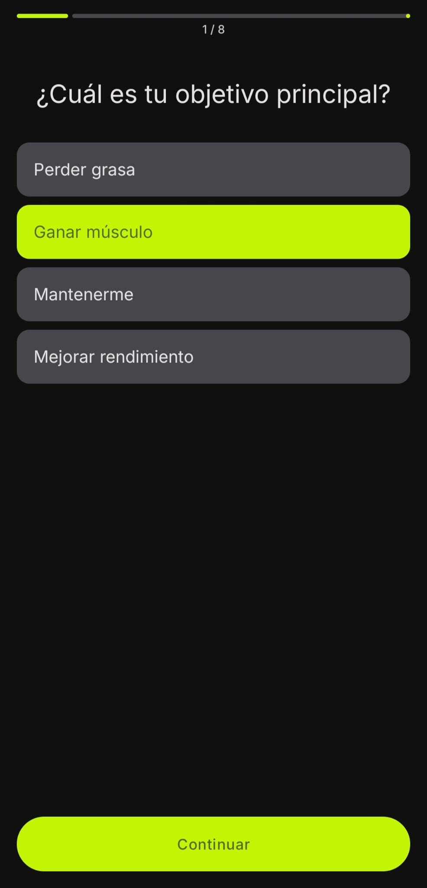
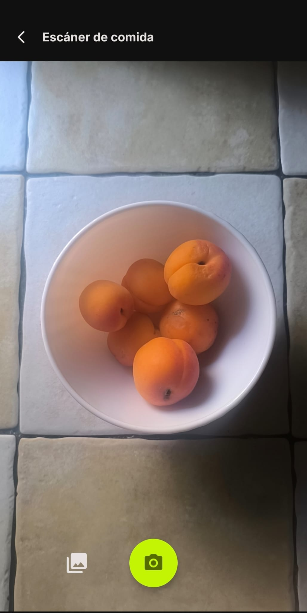
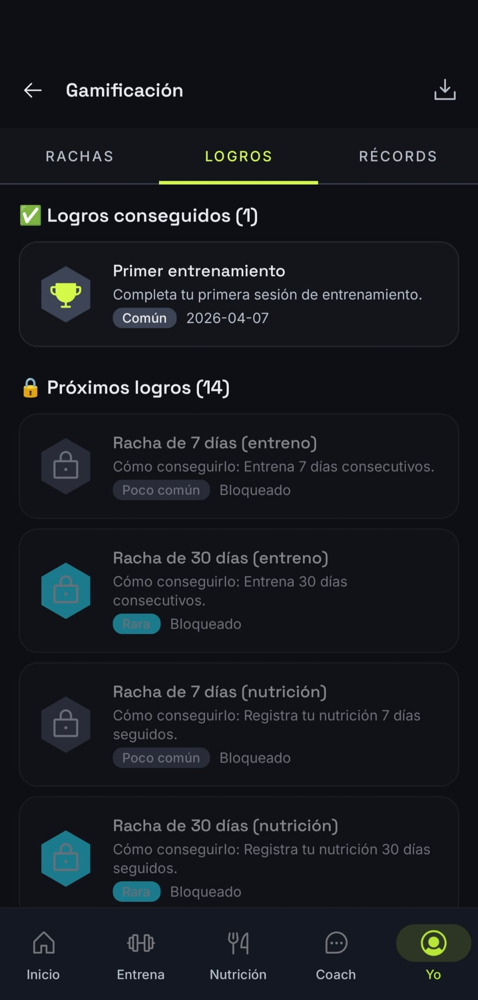

# AIFit

**English** · [Español](README.es.md)


> **Companion repository:** this project is the **Android client** for AIFit. The REST API, business logic, and AI services live in the backend.
>
> ### [AIFit Backend (AIFit-API)](https://github.com/JL-SH/AIFit-API)
>
> Without a running backend, the app cannot authenticate users, generate plans, analyze meals, or persist data.

---

## Description

**AIFit** is a mobile fitness and nutrition app that uses artificial intelligence to deliver personalized training and diet plans, progress tracking, and an integrated conversational coach.

It targets people who want structured training and nutrition without relying on an in-person trainer, with explanations adapted to their knowledge level and adjustments driven by real progress (weight, adherence, logged sessions, and more).

This repository is part of the author's **Final Degree Project (TFG)**: it demonstrates the design and implementation of the Android client using clean architecture, communication with a custom API, and a modern Jetpack Compose user experience.

---

## Screenshots

<p align="center">
  
  &nbsp;&nbsp;
  
  &nbsp;&nbsp;
  
</p>
<p align="center">
  
  &nbsp;&nbsp;
  
  &nbsp;&nbsp;
  
</p>
<p align="center">
  
  &nbsp;&nbsp;
  
  &nbsp;&nbsp;
  
</p>
<p align="center">
  
  &nbsp;&nbsp;
  
  &nbsp;&nbsp;
  
</p>

---

## Documentation

Extended project documentation lives under **`docs/`**. Each guide is available in **English** and **Spanish** (`.es.md` suffix).

| English | Español | Purpose |
|---------|---------|---------|
| [`docs/ARCHITECTURE.md`](docs/ARCHITECTURE.md) | [`docs/ARCHITECTURE.es.md`](docs/ARCHITECTURE.es.md) | Clean Architecture + MVVM, layers, and module boundaries |
| [`docs/FEATURES.md`](docs/FEATURES.md) | [`docs/FEATURES.es.md`](docs/FEATURES.es.md) | All features and 15 use cases |
| [`docs/SETUP.md`](docs/SETUP.md) | [`docs/SETUP.es.md`](docs/SETUP.es.md) | Local setup, backend URL, Google Sign-In, build and run |
| [`docs/API_INTEGRATION.md`](docs/API_INTEGRATION.md) | [`docs/API_INTEGRATION.es.md`](docs/API_INTEGRATION.es.md) | REST client, auth, API services, and error handling |
| [`docs/TESTING.md`](docs/TESTING.md) | [`docs/TESTING.es.md`](docs/TESTING.es.md) | Testing strategy and how to run tests |
| [`docs/NAVIGATION.md`](docs/NAVIGATION.md) | [`docs/NAVIGATION.es.md`](docs/NAVIGATION.es.md) | Navigation graphs, routes, and bottom tabs |
| [`docs/STATE_MANAGEMENT.md`](docs/STATE_MANAGEMENT.md) | [`docs/STATE_MANAGEMENT.es.md`](docs/STATE_MANAGEMENT.es.md) | `Result`, `UiState`, `UiEvent`, and data flow |

---

## Architecture

The project follows **MVVM** on top of **Clean Architecture**, with three layers per feature:

| Layer | Responsibility |
|-------|----------------|
| **data** | Remote sources (Retrofit), local cache (Room), DTOs, mappers, and repository implementations |
| **domain** | Domain models, repository interfaces, and use cases (pure business rules) |
| **ui** | Compose screens, ViewModels, UI state (`UiState`), and one-off events (`UiEvent`) |

**Feature modularization** groups each capability under `feature/<name>/` (`auth`, `training`, `nutrition`, `chat`, etc.), with a shared **`core`** module for networking, database, dependency injection (Hilt), Material 3 theme, and reusable components.

```
View (Compose) → ViewModel → UseCase → Repository → API / Room
```

---

## Tech stack

| Technology | Purpose |
|------------|---------|
| **Jetpack Compose** | Declarative UI and screen navigation |
| **Hilt** | Dependency injection and ViewModel scoping |
| **Retrofit** + OkHttp | HTTP client for the backend REST API |
| **Room** | Offline cache for plans, workout logs, nutrition, and chat |
| **Coroutines** + Flow | Async work and reactive data streams |
| **Material 3** | Design system, typography, and components |
| **Coil** | Image loading (profile photos, remote assets) |
| **Cloudinary** | Profile photo storage (managed by the backend) |

---

## Main features

The app covers **15 use cases**:

| # | Use case | Description |
|---|----------|-------------|
| 1 | 🔐 **Sign up & sign in** | Email/password registration or Google Sign-In |
| 2 | 👤 **Onboarding & profile** | Initial questionnaire, goals, and baseline plan generation |
| 3 | 🏋️ **Training plans (AI)** | Standard or adaptive training plan creation from the user profile |
| 4 | 📋 **Training plan management** | List, activate, pause, regenerate, and delete plans |
| 5 | 💪 **Workout session** | Log sets, rest timer, exercise substitutions, and fatigue on close |
| 6 | 🥗 **Diet plans (AI)** | Meal plans with macros and dietary preferences |
| 7 | 📊 **Nutrition diary** | Daily meal tracking, macros, and calorie targets |
| 8 | 📸 **Food photo analysis** | AI vision to identify food and estimate macros |
| 9 | 💬 **AI Coach (chat)** | Contextual chat with session history and archiving |
| 10 | 📈 **Progress dashboard** | Adherence, volume, and aggregated metrics |
| 11 | ⚖️ **Body weight logging** | Weight history and trend chart |
| 12 | 🔬 **Metabolic analysis** | Plateau detection and caloric adjustment recommendations |
| 13 | 📚 **Fitness education** | Exercise/meal explanations and level-based glossary |
| 14 | 🛒 **Shopping list** | Auto-generated list from the active diet plan |
| 15 | 🏆 **Gamification** | Achievements, streaks, personal records, and progress export |

---

## Project structure

```
AIFit/
├── app/
│   └── src/main/java/com/jlsh/aifit/
│       ├── core/                 # Network, Room, Hilt, theme, shared UI
│       ├── feature/
│       │   ├── auth/             # Login, register, Google
│       │   ├── user/             # Profile and onboarding
│       │   ├── home/             # Home screen
│       │   ├── training/         # Training plans
│       │   ├── workout/          # Sessions and workout history
│       │   ├── progression/      # Progression recommendations
│       │   ├── diet/             # Diet plans
│       │   ├── nutrition/        # Diary and nutrition targets
│       │   ├── vision/           # Food photo analysis
│       │   ├── shopping/         # Shopping lists
│       │   ├── progress/         # Weight and progress dashboard
│       │   ├── metabolic/        # Metabolic analysis
│       │   ├── chat/             # AI Coach
│       │   ├── education/        # Explanations and glossary
│       │   └── gamification/     # Achievements, streaks, export
│       └── navigation/           # Navigation graphs (auth / main)
├── docs/                         # Project documentation (see above)
│   └── img/                      # README screenshots (see Screenshots section)
├── gradle/
│   └── libs.versions.toml        # Version catalog
├── build.gradle.kts
├── settings.gradle.kts
├── README.md                     # English (default)
├── README.es.md                  # Spanish
└── local.properties              # Local config (not versioned)
```

Typical layout inside a feature:

```
feature/<name>/
├── data/       # api, dto, local, mapper, repository
├── domain/     # model, repository (interface), usecase
├── ui/         # Screen, ViewModel, state
└── di/         # Hilt module for the feature
```

---

## Prerequisites

| Requirement | Recommended version |
|-------------|---------------------|
| **Android Studio** | Ladybug (2024.2) or newer |
| **Android SDK** | `compileSdk` 35 — **`minSdk` 26** (Android 8.0+) |
| **JDK** | **17** (matches project `jvmTarget`) |

---

## Installation & configuration

### 1. Clone the repository

```bash
git clone https://github.com/JL-SH/AIFit-Android.git
cd AIFit-Android
```

### 2. Configure `local.properties`

Create or edit `local.properties` at the project root (Android Studio usually generates `sdk.dir` automatically):

```properties
sdk.dir=/path/to/your/Android/sdk

# Backend URL (emulator: 10.0.2.2 maps to host localhost)
API_BASE_URL=http://10.0.2.2:8080/api/v1/

# Google Sign-In (OAuth Web client ID)
GOOGLE_WEB_CLIENT_ID=your-client-id.apps.googleusercontent.com
```

Point the app at your backend by setting `API_BASE_URL` in the `debug` block of [`app/build.gradle.kts`](app/build.gradle.kts) to the same URL (local instance or production on Railway).

### 3. Build and run

1. Open the project in Android Studio.
2. Sync Gradle (**Sync Project with Gradle Files**).
3. Connect a device or start an emulator (API 26+).
4. Run the **app** configuration.

```bash
./gradlew assembleDebug
```

---

## Backend connection

The app is a **REST API client** for AIFit. Authentication, AI plan generation, chat, vision, and persistence all require the backend to be **running** and reachable from the device or emulator.

- Backend repository: **[AIFit-API](https://github.com/JL-SH/AIFit-API)**
- Follow that project's setup instructions (database, environment variables, Gemini, Cloudinary, etc.).
- For local development, set the correct host in `API_BASE_URL` (`10.0.2.2` on emulator, your machine's LAN IP on a physical device).

---

## License

This project is released under the **MIT License**. See [LICENSE](LICENSE) for the full text.
